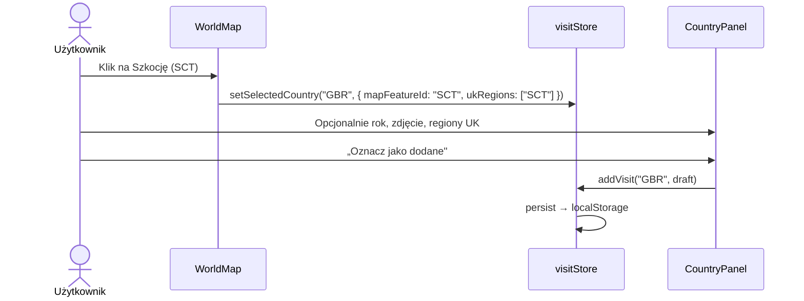
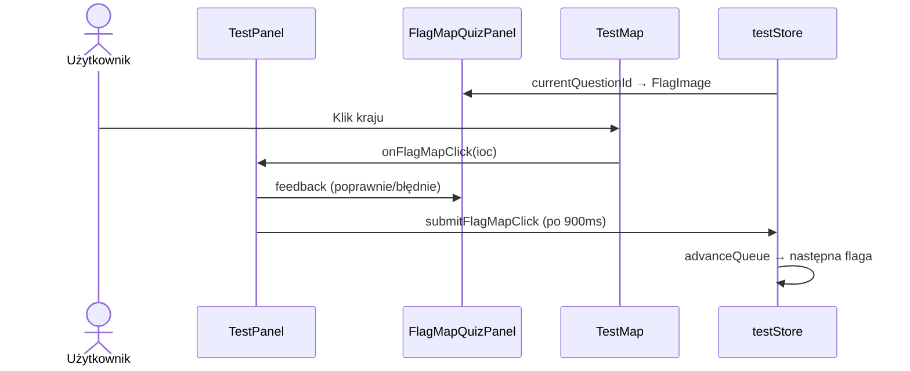

# Architektura aplikacji „I've been there"

Dokument opisuje kompletną architekturę frontendowej aplikacji do śledzenia odwiedzonych krajów i nauki geografii. Aplikacja jest w pełni kliencka — nie ma backendu, API ani bazy danych po stronie serwera.

---

## Spis treści

1. [Przegląd wysokiego poziomu](#1-przegląd-wysokiego-poziomu)
2. [Stack technologiczny](#2-stack-technologiczny)
3. [Struktura katalogów](#3-struktura-katalogów)
4. [Warstwy architektury](#4-warstwy-architektury)
5. [Przepływ danych](#5-przepływ-danych)
6. [Model domenowy](#6-model-domenowy)
7. [Warstwa danych (`data/`)](#7-warstwa-danych-data)
8. [Stan aplikacji (`store/`)](#8-stan-aplikacji-store)
9. [Logika pomocnicza (`utils/`)](#9-logika-pomocnicza-utils)
10. [Hooki (`hooks/`)](#10-hooki-hooks)
11. [Komponenty UI (Atomic Design)](#11-komponenty-ui-atomic-design)
12. [Mapa świata — szczegółowa implementacja](#12-mapa-świata--szczegółowa-implementacja)
13. [Moduł testów geograficznych](#13-moduł-testów-geograficznych)
14. [Glob 3D w nagłówku](#14-glob-3d-w-nagłówku)
15. [Eksport mapy](#15-eksport-mapy)
16. [Persystencja i migracje](#16-persystencja-i-migracje)
17. [Stylowanie](#17-stylowanie)
18. [Konfiguracja builda](#18-konfiguracja-builda)
19. [Diagramy przepływu](#19-diagramy-przepływu)
20. [Znane ograniczenia i decyzje projektowe](#20-znane-ograniczenia-i-decyzje-projektowe)

---

## 1. Przegląd wysokiego poziomu

Aplikacja pozwala użytkownikowi:

- zaznaczać kraje na interaktywnej mapie 2D (lista **206 krajów MKOl**),
- opcjonalnie przypisywać rok wizyty, zdjęcie i regiony UK (Anglia, Szkocja, Walia, Irlandia Północna),
- przeglądać listę krajów z wyszukiwarką,
- przeglądać statystyki globalne i per kontynent,
- przełączać widok mapy (świat lub wyizolowany kontynent),
- eksportować mapę jako PNG lub PDF,
- rozwiązywać **testy geograficzne** w pięciu trybach (mapa, flagi, flagi + mapa, stolice, stolice + mapa).

Wszystkie dane użytkownika są przechowywane w `localStorage` przeglądarki.

```
┌──────────────────────────────────────────────────────────────────┐
│                         index.html                               │
│                            ↓                                     │
│                      main.tsx (React)                            │
│                            ↓                                     │
│                          App.tsx                                 │
│    ┌──────────┬──────────┬──────────┬──────────┬──────────┐      │
│    ↓          ↓          ↓          ↓          ↓          ↓      │
│  Mapa     Kraje    Statystyki   Eksport     Testy    AppFooter   │
│ WorldMap  CountryList StatsPanel ExportPanel TestPanel  © 2026    │
│ +Panel                                                              │
│    ↓                          ↓                                   │
│ useVisitStore            useTestStore                             │
│    ↓                          ↓                                   │
│ localStorage (persist)   localStorage (persist)                   │
└──────────────────────────────────────────────────────────────────┘
```

---

## 2. Stack technologiczny

| Technologia | Rola |
|---|---|
| **React 18** | UI, komponenty, hooki |
| **TypeScript** | Typowanie statyczne |
| **Vite 5** | Bundler, dev server, HMR |
| **Zustand** | Globalny stan + middleware `persist` |
| **react-simple-maps** | Mapa SVG (TopoJSON → SVG paths) |
| **d3-geo** | Operacje geograficzne (centroidy) |
| **topojson-client** | Konwersja TopoJSON → GeoJSON |
| **Three.js + @react-three/fiber** | Glob 3D w nagłówku |
| **html2canvas** | Render DOM → canvas (eksport) |
| **jsPDF** | Generowanie plików PDF |

Zewnętrzne dane pobierane w runtime:

| Źródło | URL / opis |
|---|---|
| Granice krajów (TopoJSON 50m) | `https://cdn.jsdelivr.net/npm/world-atlas@2/countries-50m.json` |
| Obrysy UK (ENG/SCT/WLS/NIR) | Osobne pliki TopoJSON w `data/mapConfig.ts` |
| Flagi krajów | `https://flagcdn.com/{iso2}.svg` (via `utils/flags.ts`) |

Atlas Natural Earth 50m ma pole `name`, nie zawsze `ISO_A3` — aplikacja mapuje nazwy na kody przez `countryNames.ts` i wzbogaca geometrię w `useMapGeography`.

---

## 3. Struktura katalogów

```
src/
├── main.tsx
├── App.tsx
├── App.module.css
│
├── types/
│   ├── index.ts             # Visit, Continent, UkRegion, Export…
│   ├── test.ts              # TestMode, TestConfig, TestAnswer…
│   └── topojson-client.d.ts
│
├── data/
│   ├── constants.ts         # Etykiety, MAP_URL, STORAGE_KEY
│   ├── iocCountries.ts      # 206 krajów MKOl (ioc, iso, iso2, continent)
│   ├── capitals.ts          # Stolice + aliasy (PL/EN)
│   ├── countries.ts         # Mapowanie mapy ↔ MKOl, UK, kontynenty
│   ├── countryNames.ts      # Natural Earth name → ISO
│   ├── countryAliases.ts    # Aliasy PL do testów nazw krajów
│   ├── mapConfig.ts         # UK split, ukryte terytoria, typy GeoJSON
│   ├── continentViews.ts    # Projekcje per widok mapy
│   └── continentColors.ts
│
├── store/
│   ├── visitStore.ts        # Wizyty, selekcja, draft (v3)
│   └── testStore.ts         # Sesja testu (v3)
│
├── hooks/
│   ├── useCountryNames.ts   # Nazwy krajów (MKOl → display name)
│   ├── useMapGeography.ts   # Ładowanie i cache TopoJSON + UK
│   └── useTestTimer.ts      # Licznik czasu testu
│
├── utils/
│   ├── stats.ts
│   ├── mapStyles.ts
│   ├── testMapStyles.ts
│   ├── export.ts
│   ├── countryList.ts
│   ├── countrySearch.ts
│   ├── testScope.ts
│   ├── testAnswer.ts
│   ├── testModes.ts
│   ├── capitals.ts
│   ├── flags.ts
│   └── shuffle.ts
│
├── styles/
│   └── global.css
│
└── components/
    ├── atoms/
    ├── molecules/
    └── organisms/
```

Każdy komponent ma folder z `*.tsx`, `*.module.css` i `index.ts`.

---

## 4. Warstwy architektury

| Warstwa | Odpowiedzialność | Nie powinna |
|---|---|---|
| `types/` | Kontrakty typów | Zawierać logiki |
| `data/` | Statyczne dane referencyjne | Znać Reacta ani stanu UI |
| `store/` | Mutacje stanu globalnego | Renderować UI |
| `utils/` | Czyste funkcje (input → output) | Trzymać stanu |
| `hooks/` | Logika wielokrotnego użytku z React | Renderować JSX (poza zwracaniem danych) |
| `components/` | Prezentacja i interakcje lokalne | Bezpośrednio pisać do localStorage |
| `App.tsx` | Kompozycja, zakładki, widok mapy | Zawierać logiki domenowej |

### Atomic Design

```
atoms       → Button, Input, Badge, Globe3D, ZoomControls, FlagImage,
              QuizPromptDisplay, TestTimer, ProgressBar
molecules   → MapViewSelector, PhotoUpload, CountrySearch, UkRegionPicker,
              TestSetup, TestQuizPanel, FlagTestQuiz, CapitalTestQuiz,
              FlagMapQuizPanel, CapitalMapQuizPanel, TestQuizProgress,
              TestSummary, AppFooter, ContinentStatCard, WorldSummary
organisms   → AppHeader, WorldMap, TestMap, CountryPanel, CountryListPanel,
              StatsPanel, ExportPanel, TestPanel
```

---

## 5. Przepływ danych

### Kierunek danych (jednokierunkowy)

```
Akcja użytkownika
       ↓
Komponent (organism/molecule)
       ↓
useVisitStore / useTestStore  lub  useState lokalny (App)
       ↓
Zustand aktualizuje stan
       ↓
persist middleware → localStorage
       ↓
Subskrybenci re-renderują się
```

### Co jest globalne, a co lokalne

| Stan | Gdzie | Persystowany? |
|---|---|---|
| Lista wizyt (`visits`) | `useVisitStore` | ✅ |
| Wybrany kraj / feature mapy | `useVisitStore` | ❌ |
| Draft formularza | `useVisitStore` | ❌ |
| Sesja testu | `useTestStore` | ✅ |
| Aktywna zakładka | `App.tsx` | ❌ |
| Widok mapy (`mapView`) | `App.tsx` | ❌ |
| Zoom mapy | `WorldMap` / `TestMap` | ❌ |
| Feedback kliknięcia (test mapa) | `TestPanel` (useState) | ❌ |
| Geografia TopoJSON | `useMapGeography` (cache modułu) | ❌ |

---

## 6. Model domenowy

Plik: `src/types/index.ts`

### `Visit`

```typescript
interface Visit {
  countryId: string;      // Kod MKOl, np. "POL", "GBR"
  ukRegions?: UkRegion[]; // Opcjonalnie: ENG | SCT | WLS | NIR
  year?: number;
  photo?: string;         // Data URL (base64)
}
```

### `UkRegion`

Regiony Zjednoczonego Królestwa — osobne obrysy na mapie, jedna wizyta `GBR` w statystykach.

### `Continent` / `ContinentStats` / `ExportScope`

Bez zmian semantycznych — statystyki liczone wg kontynentu przypisanego w `iocCountries.ts`.

### Typy testów — `src/types/test.ts`

```typescript
type TestMode = 'map' | 'flags' | 'flag-map' | 'capitals' | 'capital-map';
type TestPhase = 'setup' | 'running' | 'summary';
```

---

## 7. Warstwa danych (`data/`)

### `iocCountries.ts`

**Źródło prawdy** dla listy krajów aplikacji — **206 narodowych komitetów olimpijskich (MKOl)**:

```typescript
interface IocCountry {
  ioc: string;       // np. "POL"
  name: string;      // angielska nazwa
  iso: string;       // ISO 3166-1 alpha-3 (mapowanie atlasu)
  iso2: string;      // do flag (flagcdn.com)
  continent: Continent;
}
```

Eksportuje: `IOC_COUNTRIES`, `IOC_CODES`, `IOC_BY_CODE`, `ISO_TO_IOC`, `IOC_TO_ISO`.

### `countryNames.ts`

Mapowanie nazw Natural Earth → ISO (`COUNTRY_NAME_TO_ISO`) oraz `ISO_TO_NAME`. Używane gdy TopoJSON nie ma `ISO_A3`.

### `countries.ts`

Warstwa mapowania między geometrią mapy a kodami MKOl:

| Funkcja | Opis |
|---|---|
| `mapFeatureToIoc(id)` | ENG/SCT/WLS/NIR → GBR; ISO → MKOl |
| `resolveMapFeatureFromProps(props)` | Id z properties GeoJSON |
| `isSelectableMapFeature(id)` | Czy kraj można klikać |
| `isMapFeatureVisited(id, visits)` | Wizyta z uwzględnieniem regionów UK |
| `migrateCountryId(legacy)` | Slugi / ISO → MKOl |
| `mergeUkRegions` | Łączenie regionów UK w jednej wizycie |

Kontynenty pochodzą z `IOC_COUNTRIES`, nie z osobnej ręcznej mapy.

### `mapConfig.ts`

- Źródła TopoJSON dla ENG, SCT, WLS, NIR.
- Lista ukrytych nazw terytoriów (`HIDDEN_MAP_COUNTRY_NAMES`).
- Typ `MapFeatureCollection`.

Hook `useMapGeography` ładuje atlas 50m, wzbogaca `ISO_A3`, podmienia UK na cztery obrysy.

### `capitals.ts`

`COUNTRY_CAPITALS: Record<ioc, { capital, aliases? }>` — stolice dla wszystkich 206 krajów MKOl, z polskimi aliasami tam gdzie sensowne.

### `countryAliases.ts`

Polskie aliasy nazw krajów do walidacji odpowiedzi w teście mapy (`checkCountryAnswer`).

### `continentViews.ts` / `continentColors.ts`

Konfiguracja projekcji, zoomu i kolorów statystyk — bez zmian architektonicznych.

---

## 8. Stan aplikacji (`store/`)

### `visitStore.ts` (wersja persist: **3**)

```typescript
interface VisitState {
  visits: Visit[];
  selectedCountryId: string | null;      // Kod MKOl
  selectedMapFeatureId: string | null;     // ENG/SCT/… lub ISO na mapie
  selectionDraft: SelectionDraft;
}
```

**Kluczowe zachowania:**

- Klik na Szkocję/Anglię → `countryId: 'GBR'` + opcjonalny `ukRegions`.
- `UkRegionPicker` w `CountryPanel` pozwala zawęzić wizytę do regionów UK.
- Migracja v3: konsolidacja wizyt do kodów MKOl, merge regionów UK.

Persystowane: **tylko `visits`**.

### `testStore.ts` (wersja persist: **3**)

Osobna sesja testu (`ivebeenthere-test-session`):

```typescript
interface TestState {
  phase: TestPhase;
  config: TestConfig | null;
  countryPool: string[];
  questionQueue: string[];           // Tryby z kolejką pytań
  currentQuestionId: string | null;
  answers: TestAnswer[];
  selectedCountryId: string | null;    // Tryb mapa (klik → wpisz nazwę)
  startedAt / endedAt: number | null;
}
```

Akcje: `startTest`, `submitAnswer`, `submitFlagMapClick`, `advanceQueue`, `backToSetup`, `endTest`, `resetTest`.

Tryby z kolejką (`usesQuestionQueue` w `utils/testModes.ts`): `flags`, `flag-map`, `capitals`, `capital-map`.

---

## 9. Logika pomocnicza (`utils/`)

### Statystyki i mapa

| Plik | Rola |
|---|---|
| `stats.ts` | Statystyki świata i kontynentów |
| `mapStyles.ts` | Style krajów na mapie wizyt |
| `testMapStyles.ts` | Style krajów na mapie testowej |
| `export.ts` | PNG/PDF, odczyt plików |

### Kraje i wyszukiwanie

| Plik | Rola |
|---|---|
| `countryList.ts` | Lista 206 MKOl do zakładki Kraje |
| `countrySearch.ts` | Filtrowanie listy |

### Testy

| Plik | Rola |
|---|---|
| `testScope.ts` | Pula krajów, zakres kontynentów, konfiguracja widoku testowej mapy |
| `testAnswer.ts` | `checkCountryAnswer` (nazwy + aliasy PL + UK) |
| `capitals.ts` | `getCapitalName`, `checkCapitalAnswer`, `getCapitalCountryIds` |
| `flags.ts` | URL flag z flagcdn.com |
| `testModes.ts` | Etykiety trybów, `usesQuestionQueue`, `isMapClickQuizMode` |
| `shuffle.ts` | Losowanie kolejki pytań |

---

## 10. Hooki (`hooks/`)

### `useCountryNames()`

`Map<ioc, displayName>` — nazwy z TopoJSON + fallback `IOC_COUNTRIES`.

### `useMapGeography()`

- Pobiera `countries-50m.json` (cache singleton).
- Wzbogaca properties o `ISO_A3` z `COUNTRY_NAME_TO_ISO`.
- Podmienia geometrię UK na ENG/SCT/WLS/NIR.
- Zwraca `{ geography, loading, error }`.

Używany przez `WorldMap` i `TestMap`.

### `useTestTimer()`

Licznik count-up / countdown dla modułu testów; callback `onExpire` kończy test.

---

## 11. Komponenty UI (Atomic Design)

### Zakładki aplikacji (`App.tsx`)

| Zakładka | Organizm |
|---|---|
| Mapa | `WorldMap` + `CountryPanel` |
| Kraje | `CountryListPanel` |
| Statystyki | `StatsPanel` |
| Eksport | `ExportPanel` |
| Testy | `TestPanel` |

Stopka: `AppFooter` — tagline + **© 2026, wszelkie prawa zastrzeżone**.

### Organizmy — skrót

| Komponent | Odpowiedzialność |
|---|---|
| `WorldMap` | Mapa wizyt, zdjęcia w SVG pattern, zoom, widoki kontynentów |
| `TestMap` | Mapa testowa; tryb klikania (`flag-map`, `capital-map`) |
| `CountryPanel` | Formularz kraju, `UkRegionPicker`, zdjęcie, rok |
| `CountryListPanel` | Lista 206 krajów + `CountrySearch` |
| `TestPanel` | Orkiestracja testu: setup / running / summary |
| `ExportPanel` | Podgląd i eksport PNG/PDF |

---

## 12. Mapa świata — szczegółowa implementacja

Plik: `src/components/organisms/WorldMap/WorldMap.tsx`

### Pipeline renderowania

```
useMapGeography() → TopoJSON 50m + UK constituents
       ↓
filterGeographies() — izolacja kontynentu
       ↓
<defs> — SVG patterns ze zdjęciami
       ↓
<Geography> × N
       ↓
<ZoomableGroup> — zoom + pan
       ↓
<ComposableMap>
```

### Identyfikacja kraju

```typescript
const mapFeatureId = resolveMapFeatureFromProps(geo.properties);
const ioc = mapFeatureToIoc(mapFeatureId);
```

Natural Earth często ma tylko `name` — `useMapGeography` uzupełnia `ISO_A3` przed renderem.

### Wielka Brytania

- Na mapie: **4 osobne obrysy** (ENG, SCT, WLS, NIR).
- W danych wizyt: jeden rekord **`GBR`** z opcjonalnym `ukRegions[]`.
- Statystyki: GBR liczone **raz** (nie 4×).

### Zdjęcia wypełniające kraj

SVG `<pattern>` + `preserveAspectRatio="xMidYMid slice"` — zdjęcie wypełnia bounding box kraju, przycięte do kształtu path. Podgląd draftu: opacity 75%.

---

## 13. Moduł testów geograficznych

Organizm: `TestPanel` — fazy `setup` → `running` → `summary`.

### Tryby

| Tryb | UI | Odpowiedź |
|---|---|---|
| `map` | Mapa + panel boczny | Klik kraju → wpisz nazwę |
| `flags` | Flaga (`FlagImage`) | Wpisz nazwę kraju |
| `flag-map` | Flaga + mapa | Kliknij kraj na mapie |
| `capitals` | Nazwa kraju (`QuizPromptDisplay`) | Wpisz stolicę |
| `capital-map` | Stolica + mapa | Kliknij kraj na mapie |

### Konfiguracja (`TestSetup`)

- Zakres: świat lub wybrane kontynenty (bez Antarktydy).
- Czas: count-up lub countdown (1–10 min).
- Liczba pytań: losowanie bez powtórzeń z puli (tryby z kolejką).

### Ważne zasady UX (flag-map / capital-map)

- **Brak podpowiedzi na mapie** — aktualny kraj nie jest wyróżniany obwódką.
- Po kliknięciu: krótki feedback w panelu (~900 ms), potem następne pytanie.
- Flagi: `FlagImage` + flagcdn.com; alt: „Flaga kraju do rozpoznania”.

### Walidacja odpowiedzi

- Nazwy krajów: `checkCountryAnswer` (PL + EN + aliasy, specjalne przypadki UK).
- Stolice: `checkCapitalAnswer` (EN + aliasy z `capitals.ts`).
- Klik na mapie: porównanie kodów MKOl (`clickedId === target`).

### Współdzielone molekuły testów

- `TestQuizProgress` — licznik odpowiedzi / poprawnych.
- `TestSummary` — wynik, błędy, czas.
- `TestTimer` — wyświetlacz czasu.

---

## 14. Glob 3D w nagłówku

Plik: `src/components/atoms/Globe3D/Globe3D.tsx`

`@react-three/fiber` + sfera + siatka szer./dł. geogr. (`#2563eb`), obrót `useFrame`. Używany w `AppHeader` obok retro tytułu (Press Start 2P).

`RotatingGlobe` — legacy CSS 2D, nieużywany w nagłówku.

---

## 15. Eksport mapy

`ExportPanel` → filtruje wizyty → renderuje `WorldMap` w podglądzie → `html2canvas` (2×) → PNG lub jsPDF.

Nazwa pliku: `ive-been-there-{scope}-{yearLabel}.{png|pdf}`.

---

## 16. Persystencja i migracje

### Wizyty

Klucz: `ivebeenthere-visits`, wersja **3**.

```json
{
  "state": {
    "visits": [
      { "countryId": "GBR", "ukRegions": ["SCT"], "year": 2024, "photo": "data:image/…" }
    ]
  },
  "version": 3
}
```

Migracje: slugi → MKOl; konsolidacja UK; merge duplikatów.

### Sesja testu

Klucz: `ivebeenthere-test-session`, wersja **3**.

Przechowuje aktywną sesję (faza, odpowiedzi, kolejka) — użytkownik może wrócić po odświeżeniu strony.

### Zdjęcia

Data URL w `localStorage` — limit ~5 MB per origin w większości przeglądarek; brak kompresji po stronie aplikacji.

---

## 17. Stylowanie

CSS Modules + zmienne w `global.css` (jasny motyw). Fonty: **Press Start 2P** (branding), **DM Sans** (UI).

---

## 18. Konfiguracja builda

```typescript
// vite.config.ts
resolve: { alias: { '@': './src' } }
```

| Komenda | Działanie |
|---|---|
| `npm run dev` | Dev server (:5173) |
| `npm run build` | `tsc -b` + `vite build` |
| `npm run preview` | Podgląd `dist/` |

Bundle produkcyjny ~1.7 MB JS (Three.js, jsPDF, html2canvas, dane stolic).

---

## 19. Diagramy przepływu

### Dodawanie kraju (z regionem UK)



### Test flag-map



---

## 20. Znane ograniczenia i decyzje projektowe

### Lista krajów vs ONZ

206 pozycji = **MKOl** (m.in. Anguilla, Hongkong, Portoryko), nie ~195 państw ONZ. Statystyki i testy używają tej samej listy.

### Mapa

- TopoJSON 50m — lepsze granice niż 110m, ale nadal uproszczenia.
- UK split wizualny; dane logiczne pod jednym `GBR`.
- `react-simple-maps` = SVG, nie WebGL (glob 3D tylko w nagłówku).

### Testy

- Flagi z zewnętrznego CDN (flagcdn.com) — wymaga sieci.
- Stolice: głównie nazwy angielskie + wybrane aliasy PL; kraje z wieloma stolicami administracyjnymi mają uproszczenia.

### Brak backendu

- Brak sync między urządzeniami.
- Brak kont w chmurze.
- Czyszczenie danych przeglądarki = utrata wizyt i sesji testu.

### Bundle size

Możliwy lazy load: `Globe3D`, `ExportPanel`, `TestPanel`.

---

## Szybka ściągawka — gdzie szukać czego

| Chcę zmienić… | Plik |
|---|---|
| Listę 206 krajów MKOl | `src/data/iocCountries.ts` |
| Stolice i aliasy | `src/data/capitals.ts` |
| Mapowanie mapa ↔ MKOl | `src/data/countries.ts` |
| Nazwy Natural Earth → ISO | `src/data/countryNames.ts` |
| Aliasy PL (test nazw) | `src/data/countryAliases.ts` |
| Geometrię UK / atlas | `src/data/mapConfig.ts`, `src/hooks/useMapGeography.ts` |
| Logikę wizyt | `src/store/visitStore.ts` |
| Tryby i sesję testu | `src/store/testStore.ts`, `src/utils/testModes.ts` |
| Konfigurację testu | `src/components/molecules/TestSetup/` |
| Mapę wizyt | `src/components/organisms/WorldMap/` |
| Mapę testową | `src/components/organisms/TestMap/` |
| Stopkę / copyright | `src/components/molecules/AppFooter/` |
| Eksport PNG/PDF | `src/utils/export.ts` + `ExportPanel.tsx` |

---

*Dokument dla wersji aplikacji 1.0.0. Ostatnia aktualizacja: czerwiec 2026 — MKOl 206, UK regions, moduł testów (5 trybów), stolice, countries-50m, AppFooter.*
